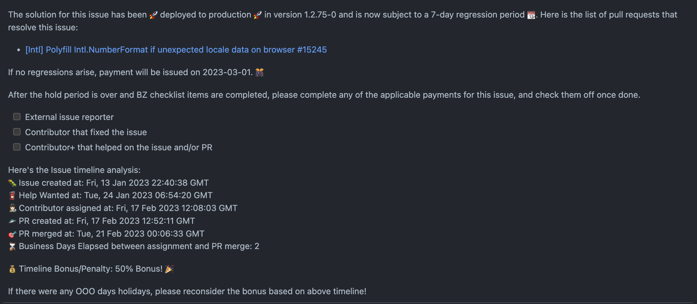

# Timeline / Days calculator
This is a demonstration for use of Github API to calculate the business days elapsed between date of assignment of contributor and date of PR merge.

Calculates date of assignment based on Melvin's comment about being assigned.

## Run tests
- `npm run test` for the two cases when an issue is bonus eligible and when not.

## Run sample
- `npm run example` for demonstration and output in console.

## Screenshots
Issue link - https://github.com/Expensify/App/issues/14307
Output:
